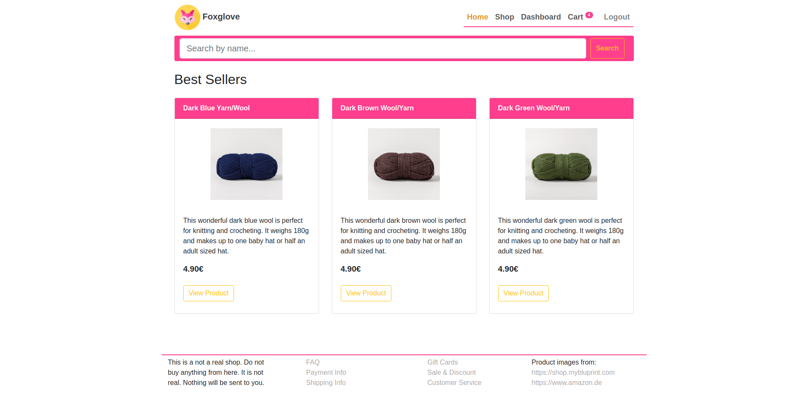
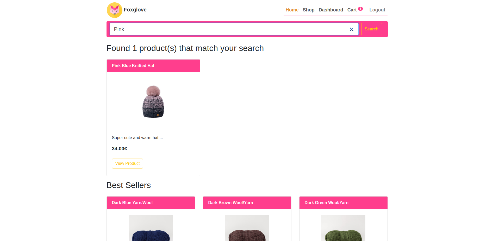
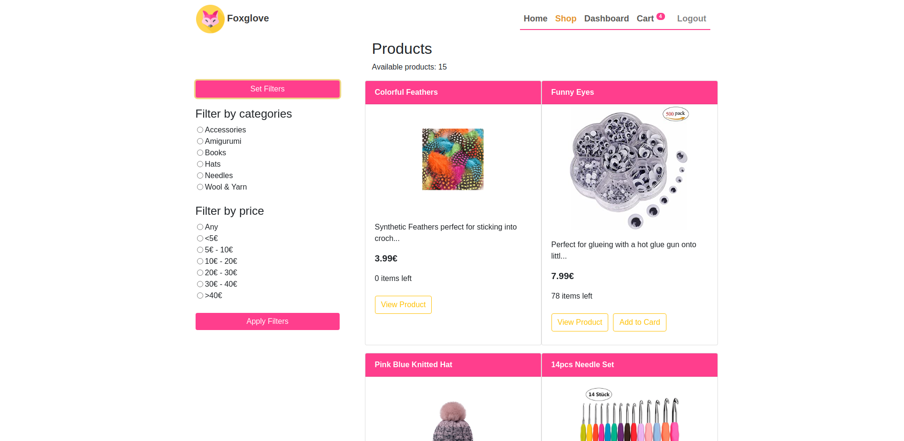
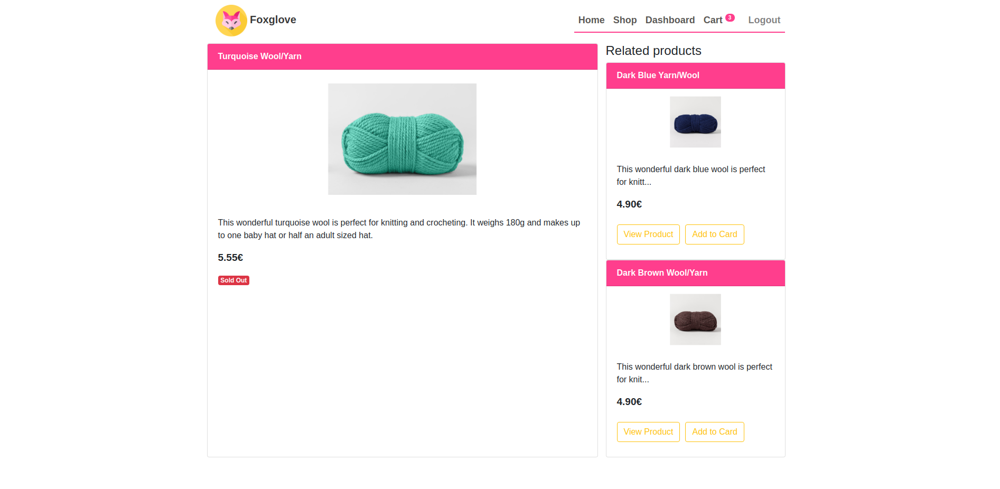
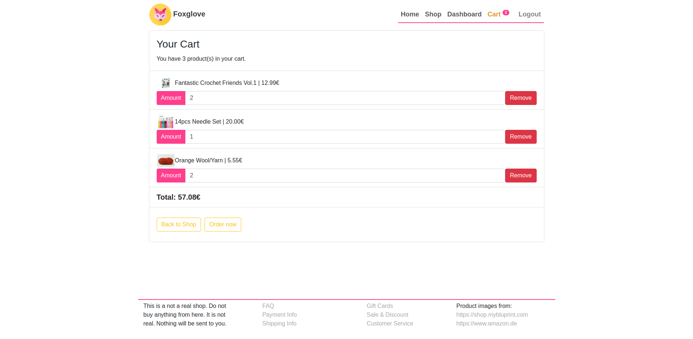
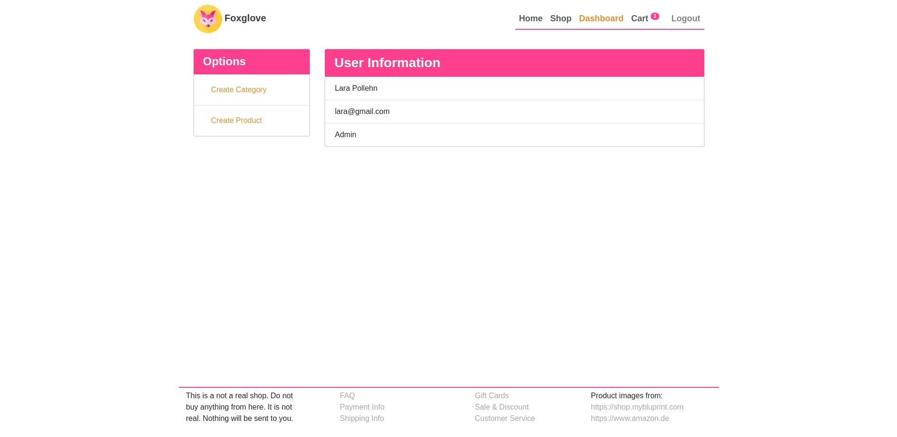

[](https://travis-ci.com/larapollehn/buchling)
### Doc for API 
https://app.swaggerhub.com/apis/larapollehn/buchling/1.0.0#/

### Features
* Login and Register user account
* Admin and User Dashboard
* Admin Options: Create Category & Create Product
* User Options: See Cart
* Home with a display of three current best-sellers
* Product-Search
* Shop view with filter options (per price range or category)
* View single Product 
* Show up to two related products next to product in product view
* Show availability of product (Sold out or in Stock)
* Add item to cart 
* Change amount of item in the cart (max amount is product quantity)
* Remove item from cart
* See total sum of items in cart

### Mobile (Xiaomi Redmi Note 5)

<table border="1" width="100%">
    <tr>
        <td></td>
        <td></td>
    </tr>
    <tr>
        <td></td>
        <td></td>
    </tr>
    <tr>
         <td></td>
         <td></td>
    </tr>
</table>

### Features that will be added in the future
* Paypal sandbox (e.g. with braintree)
* Users order history
* Update product and delete product from shop (admin only)


### Road map
- [x] First Sprint: CRUD REST-ful API (Estimation: 3 Days)
- [x] Second Sprint: Basic MVP Frontend (Estimation: 3 Days)
- [x] Last Sprint: Final Styling and responsive design (Estimation: 2 - 4 Days)  

### How to setup the project
Add proper environments in a `.env` file in directory `backend`:

```
DATABASE=mongodb://domain_name/ecommerce
PORT=8000
JWT_SECRET=secret
LOG_LEVEL=debug
```

Start the docker compose file with 

```
docker-compose up -d --build
```
